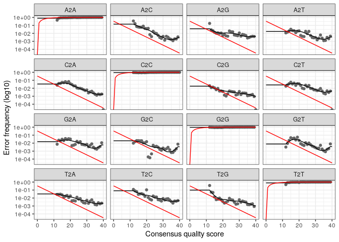

02\_data\_DADA2
================

  - [library](#library)
  - [Apprentissage des erreurs :](#apprentissage-des-erreurs)
  - [Visualitaion des modèles d’erreur du
    foward](#visualitaion-des-modèles-derreur-du-foward)
  - [Aligner les R1 et R2 en contigs](#aligner-les-r1-et-r2-en-contigs)
  - [Construire table obersavation](#construire-table-obersavation)
  - [Chimères](#chimères)
      - [Enlever les chimères par méthode
        consensus](#enlever-les-chimères-par-méthode-consensus)
  - [Evolution des filtres de
    qualités](#evolution-des-filtres-de-qualités)

# library

``` r
library(dada2)
```

    ## Loading required package: Rcpp

    ## Warning: multiple methods tables found for 'which'

``` r
library(ggplot2)
```

Les données ont été mis dans une fichier Seq\_stratif. Les données
seront attribuer une variable

``` r
path <- "~/CC2_Ecog2/Seq_stratif" # CHANGE ME to the directory containing the fastq files after unzipping.
list.files(path)
```

    ##  [1] "filtered"                            "Station5_Fond1_10sept14_R1.fastq"   
    ##  [3] "Station5_Fond1_10sept14_R2.fastq"    "Station5_Fond1_11mars15_R1.fastq"   
    ##  [5] "Station5_Fond1_11mars15_R2.fastq"    "Station5_Fond2_10sept14_R1.fastq"   
    ##  [7] "Station5_Fond2_10sept14_R2.fastq"    "Station5_Fond2_11mars15_R1.fastq"   
    ##  [9] "Station5_Fond2_11mars15_R2.fastq"    "Station5_Fond3_10sept14_R1.fastq"   
    ## [11] "Station5_Fond3_10sept14_R2.fastq"    "Station5_Median1_10sept14_R1.fastq" 
    ## [13] "Station5_Median1_10sept14_R2.fastq"  "Station5_Median2_10sept14_R1.fastq" 
    ## [15] "Station5_Median2_10sept14_R2.fastq"  "Station5_Surface1_10sept14_R1.fastq"
    ## [17] "Station5_Surface1_10sept14_R2.fastq" "Station5_Surface1_11mars15_R1.fastq"
    ## [19] "Station5_Surface1_11mars15_R2.fastq" "Station5_Surface2_10sept14_R1.fastq"
    ## [21] "Station5_Surface2_10sept14_R2.fastq" "Station5_Surface2_11mars15_R1.fastq"
    ## [23] "Station5_Surface2_11mars15_R2.fastq"

Nous allons filtrer les séquences en fonction des Fowards et des
Reverses  
On crée des variables : -FnFs : les fichiers fastq R1, c’est-à-dire du
read avant -FnRs : les fichiers fastq R2, c’est-à-dire du read arrière
-sample.names : extrait les noms des échantillons, en supposant que les
noms de fichiers ont un format : NOM DE L’ÉCHANTILLON\_XXX.fastq

``` r
# Forward and reverse fastq filenames have format: SAMPLENAME_R1_1.fastq and SAMPLENAME_R2_1.fastq
fnFs <- sort(list.files(path, pattern="_R1.fastq", full.names = TRUE))
fnRs <- sort(list.files(path, pattern="_R2.fastq", full.names = TRUE))
# Extract sample names, assuming filenames have format: SAMPLENAME_XXX.fastq
sample.names <- sapply(strsplit(basename(fnFs), "R"), `[`, 1)
```

On cherche les profils qualité

Le score de qualité est calcules pour chaque base. Un score de Q30
signifie qu’il y a une chance sur 1000 que la base soit fausse. En
dessous de Q30 , le score de qualité est dis trop faible , donc on
enleveras toutes les séquence en dessous de Q30.

``` r
plotQualityProfile(fnFs[1:2])
```

<!-- --> Dans
l’ensemble les fowards on un bon score de qualité. C’est jutse avant
250 que le score chute en dessous de Q30. Nous allons donc pour les
fowards on couper à 240.

``` r
plotQualityProfile(fnRs[1:2])
```

<!-- -->

Dans l’ensemble les reverse on un mauvais score de qualité comparée au
foward. C’est apres 150 nt que le score baisse. Mais si on coupe a 150
nous aurons pas de overlap entr les fowards et reverse. Nous allons donc
couper à 200. Mais il faudra savoir qu’il y a une partie qu’il y a une
mauvais score de qualité. Et en plus comme il y primes 21nt , il faut
couper a 200nt

On attribue les noms de fichiers pour les fichiers fastq.gz filtrés. On
crée les variables : -FiltFs : Place les fichiers filtrés avant -filtRs
: Place les fichers filtré arrière -names filtFs : place les noms des
fichiers filtré des reads avant avec leurs noms associés -names FiltRs :
place les noms des fichiers filtré des reads arrière avec leurs noms
associés

``` r
# Place filtered files in filtered/ subdirectory
filtFs <- file.path(path, "filtered", paste0(sample.names, "_F_filt.fastq.gz"))
filtRs <- file.path(path, "filtered", paste0(sample.names, "_R_filt.fastq.gz"))
names(filtFs) <- sample.names
names(filtRs) <- sample.names
```

Les paramètres de filtrage et découpage standard : -maxN=0 (DADA2 ne
nécessite pas de Ns), -truncQ=2 : on va tronquer pour les reads avant a
240 et 200 pour les reads arrières -rm.phix=TRUE -maxEE=2 -\> le nombre
maximum d’“erreurs attendues” autorisées dans une lecture, ce qui est un
meilleur filtre que la simple moyenne des scores de qualité.

Pour les foward on couperas à 240. Mais si on coupe a 150 pour les
reverses nous aurons pas de overlap entr les fowards et reverse. Nous
allons donc couper à 200. Mais il faudra savoir qu’il y a une partie
qu’il y a une mauvais score de qualité. Et en plus comme il y primes
21nt , il faut couper a 200nt

``` r
out<-filterAndTrim(fnFs, filtFs, fnRs, filtRs, truncLen=c(240,200),trimLeft=21,
              maxN=0, maxEE=c(2,2), truncQ=2, rm.phix=TRUE,
              compress=TRUE, multithread=TRUE) # On Windows set multithread=FALSE
head(out)
```

    ##                                    reads.in reads.out
    ## Station5_Fond1_10sept14_R1.fastq     159971    145448
    ## Station5_Fond1_11mars15_R1.fastq     175993    160423
    ## Station5_Fond2_10sept14_R1.fastq     197039    177018
    ## Station5_Fond2_11mars15_R1.fastq      87585     79989
    ## Station5_Fond3_10sept14_R1.fastq     117140    106150
    ## Station5_Median1_10sept14_R1.fastq   116519    106745

On obtient le nombre de nucléotide qui sont des le départ (reads.in) et
apres filtrage et découpe (read.out). Pour le reads FOND du 10 sept 2014
R1 : 159971 et apres filtration on obtient : 145448 . Il y a donc 14 523
nucléotides qui ont été enlevers

# Apprentissage des erreurs :

Il est possible d’avoir des erreurs, avec Dada2, on va inspecter les
séquences et voir les erreurs. On utilise un modèle d’erreur
paramétrique err pour les reads avant et arrière.

But : le modèle d’erreur de DADA2 permet identifier les positon avec
forte probabilité d’erreur et donc par la suite changer avec la base la
plus probable, qui ressemble donc plus à la séquence majoritaire proche
abondande.

On crée les variables : -errF : reçoit le modèle d’erreur paramétrique
par la méthode LearnErrors pour les read avant filtré (tronqué

``` r
errF <- learnErrors(filtFs, multithread=TRUE)
```

    ## 105752691 total bases in 482889 reads from 3 samples will be used for learning the error rates.

Il y a 105752691 bases totales en 139642 reads avant à partir de 20
échantillons seront utilisées pour connaître les taux d’erreur.

\-errR : recoit le modèle d’erreur paramétrique par la méthode
LearnErrors pour les read arrière filtré (tronqué)

``` r
errR <- learnErrors(filtRs, multithread=TRUE)
```

    ## 100755162 total bases in 562878 reads from 4 samples will be used for learning the error rates.

Il y a 100755162 bases totales en 139642 read arrière à partir de 20
échantillons seront utilisées pour connaître les taux d’erreur

# Visualitaion des modèles d’erreur du foward

x: probabilité y: Qsocre C’est la probabilité d’une mutation en fonction
du Qscore

ex Q40 : la probabilité dont la base trouvée est la bonne ex Q10 : la
probabilité dont la base ne soit pas la bonne ( ex: A donne un C)

``` r
plotErrors(errF, nominalQ=TRUE)
```

    ## Warning: Transformation introduced infinite values in continuous y-axis
    
    ## Warning: Transformation introduced infinite values in continuous y-axis

<!-- -->
Chaque transition (mutation) possible (A→C, A→G, …) le taux d’erreur
sont indiqués. -points : les taux d’erreur observés pour chaque score de
qualité du consensus. -ligne noire : taux d’erreur estimés après
convergence de l’algorithme d’apprentissage machine. -ligne rouge : taux
d’erreur attendus selon la définition nominale du Q-score.

Les taux d’erreur estimés (ligne noire) correspondent bien aux taux
observés (points), et les taux d’erreur diminuent avec l’augmentation de
la qualité comme prévue. Tout semble raisonnable et nous procédons avec
confiance.

``` r
plotErrors(errR, nominalQ=TRUE)
```

    ## Warning: Transformation introduced infinite values in continuous y-axis
    
    ## Warning: Transformation introduced infinite values in continuous y-axis

<!-- --> \#
Exemple d’inférence

\-variable dadaFS appliquer les modèles d’erreurs pour les read avant
(qui on été filtré avant) -objet dadaFs : plein d’information comme
l’abondance séquence, les séquences, le clustering, les err\_in et
err\_out, la qualité.. Il y aura affichage des séquence uniques dans
chaque échantilon pour les reads avant.

``` r
dadaFs <- dada(filtFs, err=errF, multithread=TRUE)
```

    ## Sample 1 - 145448 reads in 37907 unique sequences.
    ## Sample 2 - 160423 reads in 35863 unique sequences.
    ## Sample 3 - 177018 reads in 47212 unique sequences.
    ## Sample 4 - 79989 reads in 20356 unique sequences.
    ## Sample 5 - 106150 reads in 30255 unique sequences.
    ## Sample 6 - 106745 reads in 28836 unique sequences.
    ## Sample 7 - 98823 reads in 25824 unique sequences.
    ## Sample 8 - 107427 reads in 26733 unique sequences.
    ## Sample 9 - 71082 reads in 17976 unique sequences.
    ## Sample 10 - 78645 reads in 20422 unique sequences.
    ## Sample 11 - 91534 reads in 24487 unique sequences.

Nous regardons le nombre de séquence uniques dans nos jeu données. Pour
l’échantillon 1, nous avons 145558 read avec au total 37907 séquence
uniques pour les fowards

Apliquer au Reverse:

\-variable dadaRS appliquer les modèles d’erreurs pour les read arrière
( qui on été filtré avant) -objet dadaRs : plein d’information (idem que
dadaFS) comme l’abondance séquence, les séquences, le clustering, les
err\_in et err\_out, la qualité..

``` r
dadaRs <- dada(filtRs, err=errR, multithread=TRUE)
```

    ## Sample 1 - 145448 reads in 45486 unique sequences.
    ## Sample 2 - 160423 reads in 41638 unique sequences.
    ## Sample 3 - 177018 reads in 55554 unique sequences.
    ## Sample 4 - 79989 reads in 23239 unique sequences.
    ## Sample 5 - 106150 reads in 34625 unique sequences.
    ## Sample 6 - 106745 reads in 31673 unique sequences.
    ## Sample 7 - 98823 reads in 29093 unique sequences.
    ## Sample 8 - 107427 reads in 28947 unique sequences.
    ## Sample 9 - 71082 reads in 21426 unique sequences.
    ## Sample 10 - 78645 reads in 22051 unique sequences.
    ## Sample 11 - 91534 reads in 28266 unique sequences.

Nous regardons le nombre de séquence uniques dans nos jeu données. Pour
l’échantillon 1, nous avons 145558 read avec au total 45486 séquence
uniques pour les fowards.

# Aligner les R1 et R2 en contigs

but : Faire des contigs avec les reads 1 ( reads avant) et 2 (reads
arrière)

Ici c’est posssible car amplification du V4 de l’ARN 16S il y a donc un
overlap avec read1 et read2

\-verbose : montrer les étape avec du texte pendant qu’elle sont réalisé
-objet merge: liste de data.frames de chaque échantillon. Chaque
data.frame contient la séquence fusionnée, son abondance, et les indices
des variantes de la séquence avant et arrière qui ont été fusionnées.
Les lectures appariées qui ne se chevauchaient pas exactement ont été
supprimées par mergePairs, ce qui a permis de réduire davantage les
sorties parasites. -head merge : regarder la première ligne

``` r
mergers <- mergePairs(dadaFs, filtFs, dadaRs, filtRs, verbose=TRUE)
```

    ## 117318 paired-reads (in 5196 unique pairings) successfully merged out of 141000 (in 21451 pairings) input.

    ## 138940 paired-reads (in 4296 unique pairings) successfully merged out of 156462 (in 15709 pairings) input.

    ## 142188 paired-reads (in 6989 unique pairings) successfully merged out of 171439 (in 27056 pairings) input.

    ## 67622 paired-reads (in 2721 unique pairings) successfully merged out of 77764 (in 9556 pairings) input.

    ## 83613 paired-reads (in 3458 unique pairings) successfully merged out of 102224 (in 16304 pairings) input.

    ## 86212 paired-reads (in 3348 unique pairings) successfully merged out of 103447 (in 14293 pairings) input.

    ## 80661 paired-reads (in 2727 unique pairings) successfully merged out of 95866 (in 12350 pairings) input.

    ## 89385 paired-reads (in 3073 unique pairings) successfully merged out of 104354 (in 12135 pairings) input.

    ## 59716 paired-reads (in 1939 unique pairings) successfully merged out of 68711 (in 7974 pairings) input.

    ## 66157 paired-reads (in 1763 unique pairings) successfully merged out of 76701 (in 8283 pairings) input.

    ## 75048 paired-reads (in 3149 unique pairings) successfully merged out of 88514 (in 12054 pairings) input.

``` r
# Inspect the merger data.frame from the first sample
head(mergers[[1]])
```

    ##                                                                                                                                                                                                                                                                                                                                                                                sequence
    ## 1     TACGAAGGGACCTAGCGTAGTTCGGAATTACTGGGCTTAAAGAGTTCGTAGGTGGTTGAAAAAGTTAGTGGTGAAATCCCAGAGCTTAACTCTGGAACTGCCATTAAAACTTTTCAGCTAGAGTATGATAGAGGAAAGCAGAATTTCTAGTGTAGAGGTGAAATTCGTAGATATTAGAAAGAATACCAATTGCGAAGGCAGCTTTCTGGATCATTACTGACACTGAGGAACGAAAGCATGGGTAGCGAAGAGGATTAGATACCCTCGTAGTCCATGCCGTAAACGATGTGTGTTAGACGTTGGAAATTTATTTTCAGTGTCGCAGGGAAACCGATAAACACACCGCCTGGGGAGTACGACCGCAAGGTT
    ## 2     TACGAAGGGACCTAGCGTAGTTCGGAATTACTGGGCTTAAAGAGTTCGTAGGTGGTTGAAAAAGTTGGTGGTGAAATCCCAGAGCTTAACTCTGGAACTGCCATCAAAACTTTTCAGCTAGAGTATGATAGAGGAAAGCAGAATTTCTAGTGTAGAGGTGAAATTCGTAGATATTAGAAAGAATACCAATTGCGAAGGCAGCTTTCTGGATCATTACTGACACTGAGGAACGAAAGCATGGGTAGCGAAGAGGATTAGATACCCTCGTAGTCCATGCCGTAAACGATGTGTGTTAGACGTTGGAAATTTATTTTCAGTGTCGCAGCGAAAGCGATAAACACACCGCCTGGGGAGTACGACCGCAAGGTT
    ## 3     TACGAAGGGACCTAGCGTAGTTCGGAATTACTGGGCTTAAAGAGTTCGTAGGTGGTTGAAAAAGTTGGTGGTGAAATCCCAGAGCTTAACTCTGGAACTGCCATCAAAACTTTTCAGCTAGAGTTTGATAGAGGAAAGCAGAATTTCTAGTGTAGAGGTGAAATTCGTAGATATTAGAAAGAATACCAATTGCGAAGGCAGCTTTCTGGATCATTACTGACACTGAGGAACGAAAGCATGGGTAGCGAAGAGGATTAGATACCCTCGTAGTCCATGCCGTAAACGATGTGTGTTAGACGTTGGAAATTTATTTTCAGTGTCGCAGCGAAAGCGATAAACACACCGCCTGGGGAGTACGACCGCAAGGTT
    ## 4     TACGAAGGGACCTAGCGTAGTTCGGAATTACTGGGCTTAAAGAGTTCGTAGGTGGTTGAAAAAGTTAGTGGTGAAATCCCAGAGCTTAACTCTGGAACTGCCATTAAAACTTTTCAGCTAGAGTATGATAGAGGAAAGCAGAATTTCTAGTGTAGAGGTGAAATTCGTAGATATTAGAAAGAATACCAATTGCGAAGGCAGCTTTCTGGATCATTACTGACACTGAGGAACGAAAGCATGGGTAGCGAAGAGGATTAGATACCCTCGTAGTCCATGCCGTAAACGATGTGTGTTAGACGTTGGAAATTTATTTTCAGTGTCGCAGCGAAAGCGATAAACACACCGCCTGGGGAGTACGACCGCAAGGTT
    ## 5     TACGAAGGGACCTAGCGTAGTTCGGAATTACTGGGCTTAAAGAGTTCGTAGGTGGTTGAAAAAGTTGGTGGTGAAATCCCAGAGCTTAACTCTGGAACTGCCATCAAAACTTTTCAGCTAGAGTATGATAGAGGAAAGCAGAATTTCTAGTGTAGAGGTGAAATTCGTAGATATTAGAAAGAATACCAATTGCGAAGGCAGCTTTCTGGATCATTACTGACACTGAGGAACGAAAGCATGGGTAGCGAAGAGGATTAGATACCCTCGTAGTCCATGCCGTAAACGATGTGTGTTAGACGTTGGAAATTTATTTTCAGTGTCGCAGGGAAACCGATAAACACACCGCCTGGGGAGTACGACCGCAAGGTT
    ## 6 TACGAGGGGTCCTAGCGTTGTCCGGATTTACTGGGCGTAAAGGGTACGTAGGCGTTTTAATAAGTTGTATGTTAAATATCTTAGCTTAACTAAGAAAGTGCATACAAAACTGTTAAGATAGAGTTTGAGAGAGGAACGCAGAATTCATGGTGGAGCGGTGACATGCGTAGATATCATGAGGAAAGTCAAATGCGAAGGCAGCCTTCTGGCTCAAAACTGACGCTGAGGTACGAAAGCGTGGGGAGCGAACAGGATTAGATACCCTGGTAGTCCACGCCGTAAACGATGAGTATTTGGTGCTGGGGGATTCGACCCTTTCAGTGCCGTAGCTAACGCGATAAATACTCCGCCTGGGGACTACGATCGCAAGATT
    ##   abundance forward reverse nmatch nmismatch nindel prefer accept
    ## 1      5170       1       2     29         0      0      2   TRUE
    ## 2      4129       2       1     29         0      0      2   TRUE
    ## 3      3757       3       1     29         0      0      2   TRUE
    ## 4      2481       1       1     29         0      0      2   TRUE
    ## 5      2182       2       2     29         0      0      2   TRUE
    ## 6      2132       5       9     25         0      0      1   TRUE

``` r
seqtab <- makeSequenceTable(mergers)
dim(seqtab)
```

    ## [1]    11 19426

# Construire table obersavation

Construire d’une table de variant de séquences d’amplicon (ASV), une
version à plus haute résolution de la table OTU produite par les
méthodes traditionnelles.

On va partir de l’abondance, on crée la table à partir de merger

\-object seqtab : une table avec en ligne le nombre d’échantillon, en
colonne les séquences elle-même à l’intérieur ou on observer la séquence
dans l’échantillon

``` r
# Inspect distribution of sequence lengths
table(nchar(getSequences(seqtab)))
```

    ## 
    ##  352  353  362  363  364  365  366  367  368  369  370  371  372  373  374  375 
    ##    1    1    1    1    4  183   27  165  184 5608 3594 2312 2613 2738  126 1770 
    ##  376  377  378  382  386 
    ##   90    4    1    1    2

Tableau de séquences : une matrice avec des lignes correspondant aux
échantillons (et nommées par eux) et des colonnes correspondant aux
variantes de séquences (et nommées par elles).Elle contient donc les
régions d’amplification de la région v4/v5 de l’ARN 16S.

# Chimères

Pendant l’amplification pendant PCR, en théorie amplifier avec les
primer Avec le primes des Foward, on crée la séquence complémentaire,
mais pour x ou y, l’élongation s’arrête

On aura le 16 S qui n’aura pas bouger et un autre fragment sb plus court
, le cycle d’après (PCR) , on va avoir un des fragment 16 S (le rouge et
l’incomplet) qui vont s’hybrider sur un autre fragment 16 S comme un
primer et donc continuer élongation (verte) pour donner une séquence
hybride à la fin qui sera le début du rouge et a la fin du vert c’est
rare , mais quand plein de séquence possible et il faut leur enlever du
jeu de données Il n’est pas possible de détecter au niveau de la taille,
car elles sont la même taille que les autres séquences.

Il va regarder toutes les séquences rares dont le début correspond à une
séquence parent dans le même jeu donnée et la fin d’une autre séquence
parents. Appliquer a seqtab Et transférer à une la nouvelle variable
seqtab.nochim

## Enlever les chimères par méthode consensus

``` r
seqtab.nochim <- removeBimeraDenovo(seqtab, method="consensus", multithread=TRUE, verbose=TRUE)
```

    ## Identified 17869 bimeras out of 19426 input sequences.

``` r
dim(seqtab.nochim)
```

    ## [1]   11 1557

Il a été observé 17869 chimères pour 19426 sequences.

\#calculer les ratios

\-somme de seqtabl : ensemble des abondance relative de chacun des
échantilons -somme de la table seqtab.nochim : ensemble des abondace
relative sans les séquences chimériques On aura le nombre de séquences
chimériques dans la table d’obersation.

``` r
sum(seqtab.nochim)/sum(seqtab)
```

    ## [1] 0.7769154

Il y a environ 77 % qui ne sont pas des chimères , donc que l’alignement
s’est bien effectué.

``` r
1- sum(seqtab.nochim)/sum(seqtab)
```

    ## [1] 0.2230846

On a environ 22 % de chimère dans notre jeu de donnée.

# Evolution des filtres de qualités

Nous allons vérifier notre progression, nous examinerons le nombre de
lectures effectuées à chaque étape du pipeline. Nous allons donc
construire une table pour suivre le nombre de séquences enlevé à chaque
étape de bio-informatique.

\-object getN : fonction de x qui est la somme de getUniques -get
uniques : extrait les séquences uniques d’un objet dada -cbind :
concaténer plusieurs valeurs : le nombre de reads après le filtre
qualité + appliquer chaque ligne getN pour les dada + les séquence
non-chimériques. - crée la table trac : concaténation

c= valeur définir dans le vecteur cbind = n’importe quoi , détecter la
nature des objets

``` r
# Construction d'une table 
getN <- function(x) sum(getUniques(x))
track <- cbind(out, sapply(dadaFs, getN), sapply(dadaRs, getN), sapply(mergers, getN), rowSums(seqtab.nochim))
# If processing a single sample, remove the sapply calls: e.g. replace sapply(dadaFs, getN) with getN(dadaFs)
colnames(track) <- c("input", "filtered", "denoisedF", "denoisedR", "merged", "nonchim")
rownames(track) <- sample.names
head(track)
```

    ##                             input filtered denoisedF denoisedR merged nonchim
    ## Station5_Fond1_10sept14_   159971   145448    142931    143292 117318   87962
    ## Station5_Fond1_11mars15_   175993   160423    158128    158473 138940  111552
    ## Station5_Fond2_10sept14_   197039   177018    173601    174591 142188  103668
    ## Station5_Fond2_11mars15_    87585    79989     78618     78926  67622   54711
    ## Station5_Fond3_10sept14_   117140   106150    103806    104338  83613   64259
    ## Station5_Median1_10sept14_ 116519   106745    104811    105173  86212   65559

On obtient une table qui montre l’évolution du nombre de séquences à
chaque opération. En colonne les différentes étapes de bio-informatique
: la séquence de base, après le filtrage, contigs, sans les chimères On
est partie de 159971 pour arriver a 143292 contigs pour le
Station5\_Fond1\_10sept14.

\#Assignation taxonomique

Pour assigner, il faut 2 choses : un algorithme et une base de
référence. Il existe un assigneur dans Dada2, il va aller regarder
dans une base de donnée qui ont des taxonomies. La base de réfénces peut
être Green genes ou silva. Ici, il sera question de la base de donner
silva 138

Il faut charger les bases de donner silva 138 en fa.gz avec le code
présent dans le script 001\_data-import

La taxonomie de silva va être assigner à la table qui ne contient pas
les chimères donc les contigs (ASV)

Nous allons assigner une taxonomie allant du règne , phylum, class,
ordre, famille, genre et espèce.

``` r
taxa <- assignTaxonomy(seqtab.nochim, "~/silva_nr99_v138_train_set.fa.gz", multithread=TRUE)
```

Il a été trouvé 1,533 Bactéries et 24 archées, qui elle ont été assigné
certains jusqu’à la famille pour les crénarchée et pour les thermoplasma
jusqu’à l’ordre.

Nous avons chez les Archée, trois du type : Crenarchaeota,
Nitrososphaeria, Nitrosopumilales, Nitrosopumilaceae, Candidatus
Nitrosopumilus. Trois autres de type Crenarchaeota, Nitrososphaeria,
Nitrosopumilales, Nitrosopumilaceae, Candidatus Nitrosopelagicus . Et
pour finir 18 de type Thermoplasmatota, Thermoplasmata ,Marine Group II.

On a donc au final 1557 taxa.

On peut voir que le règne a été attribuer comme les phylum, la class ,
Ordre et la Famille. Il n’y a que pour certains ASV qu’il y a eu
assignation taxonomique du Genre Il faut charger une nouvelle base de
donner silva 138 en fa.gz plus spécifique pour les espèces avec le code
présent dans le script 001\_data-import. Avec cette assignation, on
essaye d’avoir des noms d’espèce qui n’aurait pas été trouvée
précédement.

``` r
taxa <- addSpecies(taxa, "~/silva_species_assignment_v138.fa.gz")
taxa.print <- taxa # Removing sequence rownames for display only
rownames(taxa.print) <- NULL
head(taxa.print)
```

    ##      Kingdom    Phylum             Class                 Order            
    ## [1,] "Bacteria" "Proteobacteria"   "Alphaproteobacteria" "SAR11 clade"    
    ## [2,] "Bacteria" "Cyanobacteria"    "Cyanobacteriia"      "Synechococcales"
    ## [3,] "Bacteria" "Proteobacteria"   "Alphaproteobacteria" "SAR11 clade"    
    ## [4,] "Bacteria" "Proteobacteria"   "Alphaproteobacteria" "SAR11 clade"    
    ## [5,] "Bacteria" "Proteobacteria"   "Alphaproteobacteria" "SAR11 clade"    
    ## [6,] "Bacteria" "Actinobacteriota" "Acidimicrobiia"      "Actinomarinales"
    ##      Family             Genus                     Species
    ## [1,] "Clade I"          "Clade Ia"                NA     
    ## [2,] "Cyanobiaceae"     "Synechococcus CC9902"    NA     
    ## [3,] "Clade I"          "Clade Ia"                NA     
    ## [4,] "Clade I"          "Clade Ia"                NA     
    ## [5,] "Clade II"         NA                        NA     
    ## [6,] "Actinomarinaceae" "Candidatus Actinomarina" NA

``` r
save.image(file="02_Dada2_tutorial_FinalEnv")
```
