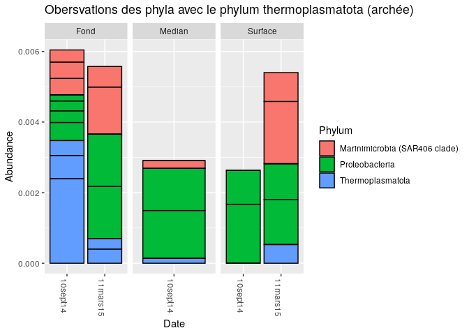

03\_Phyloseq tutorial
================

  - [Introduction](#introduction)
      - [Les librarys](#les-librarys)
      - [Les données de la rade de Brest après analyse avec
        dada2](#les-données-de-la-rade-de-brest-après-analyse-avec-dada2)
  - [Analyse avec phyloseq](#analyse-avec-phyloseq)
      - [Combiner les données dans un objet
        phyloseq](#combiner-les-données-dans-un-objet-phyloseq)
      - [Arbre phylogénétique](#arbre-phylogénétique)
      - [Les indices de diversité :
        alpha](#les-indices-de-diversité-alpha)
      - [Filtrage de la taxonomie](#filtrage-de-la-taxonomie)
          - [Indiquer les rangs dans l’ensemble des
            données](#indiquer-les-rangs-dans-lensemble-des-données)
          - [Créer un tableau, nombre de caractéristiques pour chaque
            phyla](#créer-un-tableau-nombre-de-caractéristiques-pour-chaque-phyla)
          - [Créer une table avec le nombre dans chaque
            phyla](#créer-une-table-avec-le-nombre-dans-chaque-phyla)
          - [Exécuter le filtre de prévalence, en utilisant la fonction
            `prune_taxa()`](#exécuter-le-filtre-de-prévalence-en-utilisant-la-fonction-prune_taxa)
      - [Agglomérer les taxa](#agglomérer-les-taxa)
      - [Arbres](#arbres)
      - [Abondance](#abondance)
          - [Selon la date](#selon-la-date)
      - [Ordination](#ordination)
          - [Visualisation de
            l’ordination](#visualisation-de-lordination)
      - [Bar plot](#bar-plot)
          - [phyla des bactéries](#phyla-des-bactéries)
          - [Genre des bactéries](#genre-des-bactéries)
          - [phylum des crenarchaeota](#phylum-des-crenarchaeota)
          - [phylum des thermoplasmatota](#phylum-des-thermoplasmatota)
      - [Analyse en réseau](#analyse-en-réseau)

# Introduction

## Les librarys

``` r
library(ggplot2)
library(dada2)
```

    ## Loading required package: Rcpp

    ## Warning: multiple methods tables found for 'which'

``` r
library(phyloseq)
library(dada2)
library(ggplot2)
library(dplyr)
```

    ## 
    ## Attaching package: 'dplyr'

    ## The following objects are masked from 'package:stats':
    ## 
    ##     filter, lag

    ## The following objects are masked from 'package:base':
    ## 
    ##     intersect, setdiff, setequal, union

``` r
library(reshape2)
library(ade4)
library(ggrepel)
library(lattice)
library(igraph)
```

    ## 
    ## Attaching package: 'igraph'

    ## The following objects are masked from 'package:dplyr':
    ## 
    ##     as_data_frame, groups, union

    ## The following objects are masked from 'package:stats':
    ## 
    ##     decompose, spectrum

    ## The following object is masked from 'package:base':
    ## 
    ##     union

``` r
library(ggnetwork)
```

## Les données de la rade de Brest après analyse avec dada2

``` r
load("~/CC2_Ecog2/02_Dada2_tutorial_FinalEnv")
```

# Analyse avec phyloseq

## Combiner les données dans un objet phyloseq

\-samdf = une fonction qui va permmettre de faire un graph qui englobe
les ensembles de données

``` r
samples.out <- rownames(seqtab.nochim)
profondeur <- sapply(strsplit(samples.out, "_"), `[`, 2)
profondeur <- (sapply(strsplit(samples.out, "_"), `[`, 3))
date <- substr(profondeur,1,11)
samdf <- data.frame(Profondeur=profondeur, Date=date)
samdf$Profondeur <- c("Fond","Fond","Fond","Fond","Fond", "Median","Median","Surface","Surface","Surface","Surface")
samdf$Date[samdf$Profondeur==11] <- c("mars","sept")
rownames(samdf) <- samples.out
```

## Arbre phylogénétique

Nous créons l’arbre phylogénétique en fonction des échantillons de la
rade de Brest.

``` r
library(phangorn)
```

    ## Loading required package: ape

    ## 
    ## Attaching package: 'ape'

    ## The following objects are masked from 'package:igraph':
    ## 
    ##     edges, mst, ring

    ## 
    ## Attaching package: 'phangorn'

    ## The following object is masked from 'package:igraph':
    ## 
    ##     diversity

``` r
library(DECIPHER)
```

    ## Loading required package: Biostrings

    ## Loading required package: BiocGenerics

    ## Loading required package: parallel

    ## 
    ## Attaching package: 'BiocGenerics'

    ## The following objects are masked from 'package:parallel':
    ## 
    ##     clusterApply, clusterApplyLB, clusterCall, clusterEvalQ,
    ##     clusterExport, clusterMap, parApply, parCapply, parLapply,
    ##     parLapplyLB, parRapply, parSapply, parSapplyLB

    ## The following objects are masked from 'package:igraph':
    ## 
    ##     normalize, path, union

    ## The following object is masked from 'package:ade4':
    ## 
    ##     score

    ## The following objects are masked from 'package:dplyr':
    ## 
    ##     combine, intersect, setdiff, union

    ## The following objects are masked from 'package:stats':
    ## 
    ##     IQR, mad, sd, var, xtabs

    ## The following objects are masked from 'package:base':
    ## 
    ##     anyDuplicated, append, as.data.frame, basename, cbind, colnames,
    ##     dirname, do.call, duplicated, eval, evalq, Filter, Find, get, grep,
    ##     grepl, intersect, is.unsorted, lapply, Map, mapply, match, mget,
    ##     order, paste, pmax, pmax.int, pmin, pmin.int, Position, rank,
    ##     rbind, Reduce, rownames, sapply, setdiff, sort, table, tapply,
    ##     union, unique, unsplit, which.max, which.min

    ## Loading required package: S4Vectors

    ## Loading required package: stats4

    ## 
    ## Attaching package: 'S4Vectors'

    ## The following objects are masked from 'package:dplyr':
    ## 
    ##     first, rename

    ## The following object is masked from 'package:base':
    ## 
    ##     expand.grid

    ## Loading required package: IRanges

    ## 
    ## Attaching package: 'IRanges'

    ## The following objects are masked from 'package:dplyr':
    ## 
    ##     collapse, desc, slice

    ## The following object is masked from 'package:phyloseq':
    ## 
    ##     distance

    ## Loading required package: XVector

    ## 
    ## Attaching package: 'Biostrings'

    ## The following object is masked from 'package:ape':
    ## 
    ##     complement

    ## The following object is masked from 'package:base':
    ## 
    ##     strsplit

    ## Loading required package: RSQLite

``` r
seqs <- getSequences(seqtab.nochim)
names(seqs) <- seqs # This propagates to the tip labels of the tree
alignment <- AlignSeqs(DNAStringSet(seqs), anchor=NA,verbose=FALSE)
phangAlign <- phyDat(as(alignment, "matrix"), type="DNA")
dm <- dist.ml(phangAlign)
treeNJ <- NJ(dm) # Note, tip order != sequence order
fit = pml(treeNJ, data=phangAlign)
```

    ## negative edges length changed to 0!

``` r
fitGTR <- update(fit, k=4, inv=0.2)
fitGTR <- optim.pml(fitGTR, model="GTR", optInv=TRUE, optGamma=TRUE,
        rearrangement = "stochastic", control = pml.control(trace = 0))
detach("package:phangorn", unload=TRUE)
```

``` r
ps <- phyloseq(otu_table(seqtab.nochim, taxa_are_rows=FALSE), 
               sample_data(samdf), 
               tax_table(taxa), phy_tree(fitGTR$tree))
ps
```

    ## phyloseq-class experiment-level object
    ## otu_table()   OTU Table:         [ 1557 taxa and 11 samples ]
    ## sample_data() Sample Data:       [ 11 samples by 2 sample variables ]
    ## tax_table()   Taxonomy Table:    [ 1557 taxa by 7 taxonomic ranks ]
    ## phy_tree()    Phylogenetic Tree: [ 1557 tips and 1555 internal nodes ]

Nous avons le résumé de nos échantillons. La table d’OTU comprendre 1557
taxta ( ce qui est normal, car lors de l’assignation taxonomique, nous
avions 1557 taxa trouvés). Nos échantillons étaient bien au nombre de
11. Il y a eu 7 rangs d’assigner : le reine, le phylum, la classe,
l’ordre, la fammille , le genre et l’espèce.

## Les indices de diversité : alpha

Les indices de diversité alpha sont basés sur des formules et illustrant
la complexité des peuplements. Il existent l’indice de Shannon Wiener
(H’), Indice de Simpson … Ces indices prennent en compte le nombre
d’espèces et la distribution des individus au sein de ces espèces.

L’indice de Shannon est sensible aux variations d’importance des espèces
les plus rares. L’indice de Simpson est sensible aux variations
d’importance des espèces les plus abondantes

``` r
plot_richness(ps, x="Date", measures=c("Shannon", "Simpson"), color="Profondeur")
```

<!-- -->

Si l’indice de Shannon est bas, cela veut dire que des espèces rares et
donc sont retrouvées plus facilement. De plus, il y a une espèce plus
présente par rapport aux autres.

En 10 septembre 2014 : Pour la surface, l’indice de Shannon est
inférieur à 4,5. Pour le médian, l’indice de Shannon est entre 4,5 et
4,8. Pour le fond, l’indice de Shannon est supérieur à 5,1. Il y a donc
plus d’espèces rares de manière croissante en partant du fond vers la
surface.

En mars 2015 : Pour la surface, l’indice de Shannon est supérieur à 5,1.
Pour le fond, l’indice de Shannon est supérieur à 5,1. Que l’on se
trouve en fond ou à la surface, on a un indice de shannon élevé, il y a
peu d’espèce rare.

Nous pouvons voir donc une différence des espèces en surface selon les
deux dates. Il y a beaucoup plus d’espèces rares en 2014. L’abondance en
fond est donc mieux répartie.

Si l’indice de Simpson tend vers 0, les échantillons représentent une
grande diversité, contrairement à 1 (une faible diversité).

En 10 septembre 2014 : Pour la surface, l’indice de Simpson est entre
0,96 et 0,95. Pour le médian, l’indice de Simpson est entre 0,97 et
0,98. Pour le fond, l’indice de Simpson est supérieur à 0,98.

Nous avons donc une surface avec une plus forte diversité par rapport à
ceux du fond. Ici, il est important de nuancer, il est important de
noter que notre indice de Simpson pour tous les échantillons tends vers
1. Donc pour savoir si vraiment il y a une différence, il faudrait
effectuer des tests statistique (anova).

En mars 2015 : Pour la surface, l’indice de Shannon est supérieur à
0,98. Pour le fond, l’indice de Shannon est supérieur à 0,98. Ils
présentent donc une plus faible diversité.

Il y a une différence au niveau de la diversité aux différents selon les
dates. Les résultats avec l’indice de Shannon concordent avec ceux de
l’indice de Simpson.

## Filtrage de la taxonomie

### Indiquer les rangs dans l’ensemble des données

La fonction rank-names: permet de déterminer les rangs taxonomiques de
taxa.print

``` r
rank_names(taxa.print)
```

    ## [1] "Kingdom" "Phylum"  "Class"   "Order"   "Family"  "Genus"   "Species"

### Créer un tableau, nombre de caractéristiques pour chaque phyla

La fonction tax\_table : permet de construire et d’accéder à une table
de nom taxonomique de l’objet taxa.print

Table : permet faire un tableau de contingence en fonction de différents
facteurs, ajout tax\_table, au niveau du phylum, il exclut quand ce ne
sont pas des phyla. Le résultat indique le nombre de séquences
appartenant au phylum désigné.

``` r
table(tax_table(ps)[, "Phylum"], exclude = NULL)
```

    ## 
    ##              Actinobacteriota                  Bacteroidota 
    ##                            22                           238 
    ##              Bdellovibrionota              Campilobacterota 
    ##                            35                             1 
    ##                   Chloroflexi                 Crenarchaeota 
    ##                            21                             6 
    ##                 Cyanobacteria                  Dadabacteria 
    ##                           142                             3 
    ##                  Dependentiae              Desulfobacterota 
    ##                             1                             8 
    ##               Elusimicrobiota                Fibrobacterota 
    ##                             1                             3 
    ##               Gemmatimonadota               Hydrogenedentes 
    ##                             7                             1 
    ##              Margulisbacteria Marinimicrobia (SAR406 clade) 
    ##                            23                            81 
    ##                   Myxococcota                         NB1-j 
    ##                             5                             2 
    ##                  Nitrospinota                       PAUC34f 
    ##                            20                             3 
    ##               Planctomycetota                Proteobacteria 
    ##                            32                           786 
    ##  SAR324 clade(Marine group B)              Thermoplasmatota 
    ##                            16                            18 
    ##             Verrucomicrobiota                          <NA> 
    ##                            71                            11

Certaines espèces sont retrouvées qu’une fois dans les échantillons
comme les Campilobacterota, Hydrogenedentes,Dependentiae,
Elusimicrobiota. Le phylum le plus importante est celui des
Proteobacteria avec ensuite celui des Bacteroidota.

### Créer une table avec le nombre dans chaque phyla

\-subset\_taxa : Il accélére le remplacement d’objets expérimentaux par
un appel de fonction. Le sous-ensemble sera basé sur une expression liée
aux colonnes et aux valeurs dans le créneau tax\_table

On supprime les OTU qui ont un résultat manquant ou un résultat
affichant NA. Les phyla qui ne sont ‘uncharacterized’. On enlève ceux
qu’on n’a pas réussi à catégoriser

``` r
ps <- subset_taxa(ps, !is.na(Phylum) & !Phylum %in% c("", "uncharacterized"))
```

Nous allons observer la prévalence de nos échantillons. -apply :
Retourne un vecteur, un tableau ( ici OTU-table de ps ) ou une liste de
valeurs obtenus en appliquant une fonction aux marges d’un tableau ou
d’une matrice.

``` r
prevdf = apply(X = otu_table(ps),
               MARGIN = ifelse(taxa_are_rows(ps), yes = 1, no = 2),
               FUN = function(x){sum(x > 0)})
```

\-data.frame : La fonction est de crée des cadres de données, des
collections de variables étroitement couplées qui partagent de
nombreuses propriétés des matrices et des listes, utilisées comme
structure de données fondamentale par la plupart des logiciels de
modélisation de R. Ici les données sont la prévalence, le total
d’abondance de ps et la table de taxonomie

On définit une variable prevdf qui est permet de montrer la prévalence
des caractéristiques dans notre jeu de données. On calcul la prévalence
de chaque caractéristiques de chaque data frame. Puis on ajoute les
reads à ces data frame et on réassigne une taxonomie

``` r
prevdf = data.frame(Prevalence = prevdf,
                    TotalAbundance = taxa_sums(ps),
                    tax_table(ps))
```

\-ddply : Pour chaque sous-ensemble d’une trame de données, appliquer la
fonction puis combiner les résultats dans une trame de données. -Cbind :
permet d’afficher les deux résultats en deux colonnes

``` r
plyr::ddply(prevdf, "Phylum", function(df1){cbind(mean(df1$Prevalence),sum(df1$Prevalence))})
```

    ##                           Phylum        1    2
    ## 1               Actinobacteriota 3.727273   82
    ## 2                   Bacteroidota 3.978992  947
    ## 3               Bdellovibrionota 2.342857   82
    ## 4               Campilobacterota 2.000000    2
    ## 5                    Chloroflexi 4.238095   89
    ## 6                  Crenarchaeota 4.500000   27
    ## 7                  Cyanobacteria 3.204225  455
    ## 8                   Dadabacteria 4.666667   14
    ## 9                   Dependentiae 1.000000    1
    ## 10              Desulfobacterota 2.000000   16
    ## 11               Elusimicrobiota 1.000000    1
    ## 12                Fibrobacterota 2.666667    8
    ## 13               Gemmatimonadota 2.428571   17
    ## 14               Hydrogenedentes 1.000000    1
    ## 15              Margulisbacteria 1.826087   42
    ## 16 Marinimicrobia (SAR406 clade) 4.456790  361
    ## 17                   Myxococcota 2.400000   12
    ## 18                         NB1-j 1.500000    3
    ## 19                  Nitrospinota 3.950000   79
    ## 20                       PAUC34f 3.333333   10
    ## 21               Planctomycetota 3.437500  110
    ## 22                Proteobacteria 4.296438 3377
    ## 23  SAR324 clade(Marine group B) 4.687500   75
    ## 24              Thermoplasmatota 2.722222   49
    ## 25             Verrucomicrobiota 3.788732  269

La première colonne montre les différents phyla, la deuxième colonne
montre la prévalence moyenne et la troisième colonne monte la prévalence
totale (nombre total des échantillons). Cela veut dire qu’on a observé
parmi tous les échantillons pour Actinobacteria observé au total 82
fois. Il serait bien de montrer aussi le nombre de fois qu’on les
retrouve dans les échantillons et ainsi voir comment est calculée la
prévalence moyenne.

La prévalence totale correspond aux nombres du phyla observé dans tous
les échantillons et la prévalence moyenne correspond au nombre du phyla
divisé par le nombre d’échantillons dans lequel il se trouve.

Les Dependentiae ont été retrouvées que dans 1 échantillon.

\-c() : la fonction combine les arguments “Dependentiae”,
“Campilobacterota”, “Elusimicrobiota”, “Fibrobacterota”,
“Hydrogenedentes”, “NB1-j” dans une nouvelle variable appelé
filtrePhyla. Ces phylas correspondent au taxa peut retrouver et donc
peut supposer que c’est des erreurs de séquençage. Nous allons donc les
retirer.

``` r
filterPhyla = c("Dependentiae", "Campilobacterota", "Elusimicrobiota", "Fibrobacterota", "Hydrogenedentes", "NB1-j")
```

``` r
ps1 = subset_taxa(ps, !Phylum %in% filterPhyla)
ps1
```

    ## phyloseq-class experiment-level object
    ## otu_table()   OTU Table:         [ 1537 taxa and 11 samples ]
    ## sample_data() Sample Data:       [ 11 samples by 2 sample variables ]
    ## tax_table()   Taxonomy Table:    [ 1537 taxa by 7 taxonomic ranks ]
    ## phy_tree()    Phylogenetic Tree: [ 1537 tips and 1535 internal nodes ]

Après le filtrage, on plut les mêmes “résumer” pour notre objet
phyloseq. Au départ nous la table d’OTU avec 1557 taxa, maintenant elle
est au nombre de 1538. On a donc perdu 19 OTU.

On assigne une nouvelle variable partir de la filtration effectuée
précédemment donc sans les phyla retiré précédemment. -ggplot: la
fonction sert à réaliser un graphique avec différents paramètres.

``` r
prevdf1 = subset(prevdf, Phylum %in% get_taxa_unique(ps1, "Phylum"))
ggplot(prevdf1, aes(TotalAbundance, Prevalence / nsamples(ps),color=Phylum)) +
  # Include a guess for parameter
  geom_hline(yintercept = 0.05, alpha = 0.5, linetype = 2) +  geom_point(size = 2, alpha = 0.7) +
  scale_x_log10() +  xlab("Total Abundance") + ylab("Prevalence [Frac. Samples]") +
  facet_wrap(~Phylum) + theme(legend.position="none")
```

<!-- --> Le
graphique montre la prévalence en fonction des abondances totales des
différents phyla. Chaque points dans les figures correspond à un taxa
différents. On retrouve bien une grand proportion de protéobactéria.

On définit le seuil de prévalence à 5% Création d’une nouvelle variable
qui affiche le nombre total d’échantillon 11 \* 0,05

``` r
prevalenceThreshold = 0.05 * nsamples(ps)
prevalenceThreshold
```

    ## [1] 0.55

La prévalence avec le seuil à 0,05% indique 0,55.

### Exécuter le filtre de prévalence, en utilisant la fonction `prune_taxa()`

\-prune\_taxa: Une méthode générique S4 pour supprimer les OTU non
désirés des objets phylogénétiques, y compris les arbres, ainsi que
les objets phyloseq natifs des paquets.

``` r
keepTaxa = rownames(prevdf1)[(prevdf1$Prevalence >= prevalenceThreshold)]
ps2 = prune_taxa(keepTaxa, ps)
```

## Agglomérer les taxa

Combien de genres seraient présents après le filtrage? On prend ps2 qui
a eu le filtrage et la prévalence, on lui assigne jusqu’au rang «genre»
les ASV. Obtenir la longueur des vecteurs de ps2.

``` r
length(get_taxa_unique(ps2, taxonomic.rank = "Genus"))
```

    ## [1] 103

\-tax\_glom : La fonction permet de fusionner des espèces qui ont la
même taxonomie à un certain rang taxonomique en utilisant des données
catégorielles au lieu d’un arbre. jusqu’au «genre» à partir de ps2, on
obtient alors ps3.

``` r
ps3 = tax_glom(ps2, "Genus", NArm = TRUE)
```

\-H1 permet de définir la hauteur -ps4 c’est un variable où on agglomère
les taxa étroitement liés en utilisant le regroupement à lien unique.
-tip\_glom : La fonction permet de séparées les pointes de l’arbre par
une distance cophénique inférieure à h seront agglomérées en un seul
taxon à l’aide de merge\_taxa. Ici h = 0,4

``` r
h1 = 0.4
ps4 = tip_glom(ps2, h = h1)
```

## Arbres

\-multiPlotTitleTextSize: cela permet de mettre une taille de police au
titre des arbres. -plot\_tree : La fonction permet de dessiné un
diagramme en arbre des fréquences (sous forme de nœuds) et des
probabilités (sous forme d’arêtes)

On crée l’arbre ps2, ps3 et ps4 avec la fonction plot\_tree On a les
arbres phylogénétiques correspondants à ps2, ps3 et ps4

``` r
multiPlotTitleTextSize = 15
p2tree = plot_tree(ps2, method = "treeonly",
                   ladderize = "left",
                   title = "Before Agglomeration") +
  theme(plot.title = element_text(size = multiPlotTitleTextSize))
p3tree = plot_tree(ps3, method = "treeonly",
                   ladderize = "left", title = "By Genus") +
  theme(plot.title = element_text(size = multiPlotTitleTextSize))
p4tree = plot_tree(ps4, method = "treeonly",
                   ladderize = "left", title = "By Height") +
  theme(plot.title = element_text(size = multiPlotTitleTextSize))
```

\-grid.arrange : La fonction permet de configurez une mise en page de
gtable pour placer plusieurs grobs sur une page.

``` r
gridExtra::grid.arrange(nrow = 1, p2tree, p3tree, p4tree)
```

<!-- -->

## Abondance

Diagrammes à barres de l’abondance relative des taxa dans les
échantillons. -plot\_abundance : diagrammes à barres de l’abondance
relative des taxa avec des arguments pour la forme, les couleurs ..

Nous allons nous intéresser au phylum des cyanobactéries, car c’est un
genre qui est à la surface et nous avons pu voir qu’il y avait des
différence entre la surface celon les dates. Et logiquement, c’est un
groupe que l’on ne trouve qu’en surface.

### Selon la date

``` r
plot_abundance_D = function(physeq,title = "",
                          Facet = "Order", Color = "Phylum"){
  # Arbitrary subset, based on Phylum, for plotting
  p1f = subset_taxa(physeq, Phylum %in% c("Cyanobacteria"))
  mphyseq = psmelt(p1f)
  mphyseq <- subset(mphyseq, Abundance > 0)
  ggplot(data = mphyseq, mapping = aes_string(x = "Date",y = "Abundance",
                              color = Color, fill = Color)) +
    geom_violin(fill = NA) +
    geom_point(size = 1, alpha = 0.3,
               position = position_jitter(width = 0.3)) +
    facet_wrap(facets = Facet) + scale_y_log10()+
    theme(legend.position="none")
}
```

Transformer en abondance relative :

On a une nouvelle objet “ps3ra” -transform\_sample\_counts :La fonction
transforme les comptages d’échantillons d’une matrice d’abondance de
taxons selon une fonction fournie par l’utilisateur. Les comptages de
chaque échantillon seront transformés individuellement.

``` r
ps3ra_D = transform_sample_counts(ps3, function(x){x / sum(x)})
```

On fait des plot pour voir nos abondances relatives : -plot\_abundance :
déjà expliqué Maintenant on fait des graphes qui compare avant les
abondances relatives et après transformation des abondances relatives

``` r
plotBefore_D = plot_abundance_D(ps3,"")
plotAfter_D = plot_abundance_D(ps3ra_D,"")
```

``` r
gridExtra::grid.arrange(nrow = 1, plotBefore_D, plotAfter_D)
```

<!-- --> Ces
graphiques montrent alors la différence entre les abondances originales
et les abondances relatives. Nous voyons la comparaison des abondances
initiales (panneau à gauche) et des abondances relatives (panneau à
droite).Les cyanobactéries sont retrouvé en 2 genres les
cynaobactériales et les synechococcales.

En septembre 2014 : -les deux genres étaient présents dans les mêmes
proportions que l’on regarde avec l’abondace relative ou avec
l’abondance initiale. -la classe des cynaobactériales semble avoir une
distribution bimodale -la classe des synechococcales semble avoir une
distribution monomodale

En mars 2015 : -la classe cynaobactériales n’étais plus présente. -la
classe synechococcales semble avoir une distribution monomodale

La différence majeure est que les cynaobactériales n’étais plus présente
et l’abondance des synechococcales étaient différentes. D’ou peut être
le faite qu’il est changement de population et donc avec les indices
d’alpha diversité.

``` r
psOrd_D = subset_taxa(ps3ra_D, Order == "Synechococcales")
```

    ## Warning in prune_taxa(taxa, phy_tree(x)): prune_taxa attempted to reduce tree to 1 or fewer tips.
    ##  tree replaced with NULL.

``` r
plot_abundance_D(psOrd_D, Facet = "Genus", Color = NULL)
```

<!-- --> C’est
le ordre synechococcus CC9902 qui domine. La distribution est monomodale
dans les deux cas. C’est juste que la forme de distribution est
différent. Pour septembre 2014, la distribution de l’abondance est plus
hétérogène, alors que pour mars 2015, elle tourne autour des mêmes
valeurs.

``` r
psOrd_D = subset_taxa(ps3ra_D, Order == "Cyanobacteriales")
plot_abundance_D(psOrd_D, Facet = "Genus", Color = NULL)
```

    ## Warning in max(data$density): no non-missing arguments to max; returning -Inf

    ## Warning: Computation failed in `stat_ydensity()`:
    ## replacement has 1 row, data has 0

<!-- -->

C’est l’ordre Atelocyanobacterium qui domine. La distribution est
monomodale. Il y a également des Trichodesmium. Il n’y a qu’un
échantillon.

## Ordination

L’interprétation d’un tracé de PCoA : Les objets ordonnés plus près les
uns des autres sont plus similaires que ceux ordonnés plus loin. La
(dés) similitude est définie par la mesure utilisée dans la
construction de la matrice de (dés) similitude utilisée en entrée. Les
valeurs négatives correspondent à des nombres imaginaires sont générés
lors de l’analyse et empêchent la représentation euclidiennes.

``` r
# Transform data to proportions as appropriate for Bray-Curtis distances
ps.prop <- transform_sample_counts(ps, function(tax_table) tax_table/sum(tax_table))
ord.pcoa.bray <- ordinate(ps.prop, method="PCoA", distance="bray")
```

### Visualisation de l’ordination

``` r
plot_ordination(ps.prop, ord.pcoa.bray, color="Profondeur", shape = "Date", title="Ordination d'un PCoA avec l'indice de Bray-Curtis ")
```

<!-- -->

Analyse : Pour mars 2015 (triangles) : -les points représentants les
échantillons du fond et de la surface sont très proches. On peut voir
qu’ils sont regroupés vers la droite du graphique. Lors de
l’échantillonnage, la diversité des OTU était quasiment la même.

Pour septembre 2014 (ronds) -les points représentants les différentes
profondeurs sont très éloignés les uns et donc montre une population
diversifiée à chaque niveau de profondeur. -Pour le médian et la surface
sont assez proches contrairement aux points représentant le fond qui est
totalement éloigné des autres points. Il y a donc un désaccord au niveau
des OTU retrouvés.

En comparant les points entre les dates et la surface, les OTU montrent
un éloignement entre eux. Selon la saison, la diversité change comme le
montre le PCoA.

## Bar plot

### phyla des bactéries

``` r
top20 <- names(sort(taxa_sums(ps), decreasing=TRUE))[1:10]
ps.top20 <- transform_sample_counts(ps, function(OTU) OTU/sum(OTU))
ps.top20 <- prune_taxa(top20, ps.top20)
plot_bar(ps.top20, x="Date", fill="Phylum", title="Obersvation des phyla les plus importants des bactéries") + facet_wrap(~Profondeur, scales="free_x")
```

<!-- -->

Analyse de bar plot des phyla des bactéries :

\-Le phylum des Cyanobactéries se retrouve principalement en surface et
en zone médiane, cela s’explique par le fait que ces bactéries, pour
leur croissance, ont besoin de lumière -En septembre, il est normal de
retrouver, il y a plus de cyanobactéries en septembre, car l’été
(soleil) est passé et donc il y a eu un développement des cyanobactérie
comparé au mois mars. -Le phylum de Proteobacteria est le phylum qui est
majoritaire peut importe la profondeur et la date. D -Dans la table
taxa.print, les Protéobactéries sont divisées en deux groupes retrouvés
: les alphaprotéobactéries et les gammaprotéobactéries. Ces dernières
peuvent se retrouver dans les intestins, mais aussi dans l’eau de pluie.
Le temps breton comme nous le connaissons était souvent pluvieux et donc
propice aux intempéries. Il est normal de trouver ces bactéries dans la
rade de Brest.

En mars 2015 : Pour le fond ou la surface, garde la même tendance et les
mêmes proportions. C’est cohérent avec la PCoA effectuée précédemment.
C’est-à-dire des Proteobactérie, des actinobactérie et des
Marinimicrobia dans l’ordre décroissant.

En septembre 2014 : Pour le fond,le phylum Bacteroidota est en plus
forte quantité. Pour le niveau médian et la surface, le niveau
d’abondance est sensiblement le même. C’est cependant au niveau des
phyla Cyanobacteria, Marinimicrobia qu’une variation est visible. Ici
encore, ceci correspond aux résultats étudiés lors de la PCoA.

### Genre des bactéries

``` r
top20 <- names(sort(taxa_sums(ps), decreasing=TRUE))[1:20]
ps.top20 <- transform_sample_counts(ps, function(OTU) OTU/sum(OTU))
ps.top20 <- prune_taxa(top20, ps.top20)
plot_bar(ps.top20, x="Date", fill="Genus", title="Obersvation des genres les plus importants des bactéries") + facet_wrap(~Profondeur, scales="free_x")
```

<!-- -->

Analyse du bar plot des genres des bactéries :

Pour le fond de la rade de Brest pour les deux dates, on retrouve en
plus grande proportion le genre de clade Ia (vert), puis en plus petit
quantité les SUP05 cluster (violet) et après les NS5 marine group
(bleu). Sachant qu’il y a une grande proportion dans les deux cas de NA.

Pour le médian, on trouve en majorité le cladIa , puis les Synechoccocus
CC9902 (rose) avec les Ascidiceihabitans (marron) dans des proportions
équivalentes.

Pour la surface, les Synechoccocus CC9902 dominent en septembre alors
que c’est le clade IA en mars. Le deuxième genre majoritaire en
septembre est le clade IA, alors que pour mars, c’est des SUP05 cluster.
Sachant qu’il y a une grande proportion de non caractériser. Pour mars
2015, les Ascidiceihabitans et les Synechoccocus CC9902 ne sont plus
présents.

En ce qui concerne le fond, hormis le fait qu’il n’y ait plus la
présence d’Amylibacter en 2015, les genres retrouvés sont les mêmes à
des abondances plus faibles, mais restent proportionnelles.

Globalement, on a un genre qui se trouve dans n’importe qu’elle
profondeur qu’elle que soit la date, c’est le cladeIa. La seule
différente entre les dates que l’on peut noter pour les genres est dans
la surface. En effet ont les Synechoccocus CC9902 qui dominent en
septembre.

### phylum des crenarchaeota

``` r
top20 <- names(sort(taxa_sums(ps), decreasing=TRUE))[175:179]
ps.top20 <- transform_sample_counts(ps, function(OTU) OTU/sum(OTU))
ps.top20 <- prune_taxa(top20, ps.top20)
plot_bar(ps.top20, x="Date", fill="Phylum",title="Obersvation des phyla avec le phylum crenarchaeota (archée)") + facet_wrap(~Profondeur, scales="free_x")
```

<!-- --> Analyse
des bar plot des archées(crenarchaeota) :

En septembre 2014 : Pour le fond, il y a des crenarchaeota. On a
l’impression qu’elle sont présente en grande proportion dans nos
échantillons , mais il faut savoir que tous ne sont pas représentés et
donc au final les crenarchaeota ne pèse pas beaucoup dans l’abondance.
Pour le médian, il y a également des crenarchaeota, mais avec une
proportion plus mince que le fond Pour la surface, il n’y pas a des
crenarchaeota

En mars 2015 : Pour le fond, il y a des crenarchaeota. Pour la surface,
il y a aussi des crenarchaeota, mais en proportion plus faible que le
fond.

### phylum des thermoplasmatota

``` r
top20 <- names(sort(taxa_sums(ps), decreasing=TRUE))[283:286]
ps.top20 <- transform_sample_counts(ps, function(OTU) OTU/sum(OTU))
ps.top20 <- prune_taxa(top20, ps.top20)
plot_bar(ps.top20, x="Date", fill="Phylum", title="Obersvations des phyla avec le phylum thermoplasmatota (archée)") + facet_wrap(~Profondeur, scales="free_x")
```

<!-- -->

Analyse des bar plot des archées (thermoplasmatota) :

En septembre 2014 : Pour le fond, il y a des thermoplasmatota. On a
l’impression qu’elle sont présente en grande proportion dans nos
échantillons , mais il faut savoir que tous ne sont pas représentés et
donc au final les thermoplasmatota ne pèse pas beaucoup dans
l’abondance. Pour le médian, il y a également des thermoplasmatota,
mais avec une proportion plus mince que le fond Pour la surface, il n’y
pas a des thermoplasmatota

En mars 2015 : Pour le fond, il y a des thermoplasmatota. Pour la
surface, il y a aussi des thermoplasmatota, mais en proportion plus
faible que le fond.

Pour les deux phyla des archées. On a des mêmes variations. Pour le fond
, elle sont présentes dans le fond pour les deux années en grande
proportion (il faut se rappeler que c’est subjectif qu’au final cela ne
représente que 23 des taxa sur 1557 taxa.), assez peu au niveau médian
et sont présentes en plus grande quantité que le médian, mais reste
inférieures à celles du fond. De plus en surface, 2014 aucun des 2
phyla est présent alors qu’en mars 2015.

En 2014, le fond a présenté une plus grande quantité de phyla d’archée
contrairement à mars 2015, on peut l’expliquer par le fait qu’une partie
de cette population se retrouve en surface.

## Analyse en réseau

``` r
net <- make_network(ps, max.dist=0.35)
sampledata <- data.frame(sample_data(ps))
V(net)$date <- sampledata[names(V(net)), "Date"]
V(net)$Profondeur <- sampledata[names(V(net)), "Profondeur"]
net_graph <- ggnetwork(net)
ggplot(net_graph, aes(x = x, y = y, xend = xend, yend = yend), layout = "fruchtermanreingold") +
  geom_edges(color = "darkgray") +
  geom_nodes(aes(color = date, shape = Profondeur),  size = 3) +
  theme(axis.text = element_blank(), axis.title = element_blank(),
        legend.key.height = unit(0.5,"line")) +
  guides(col = guide_legend(override.aes = list(size = .5)))
```

<!-- -->

Analyse en réseau :

\-les points (rond, carré triangle) correspondant aux échantillons -les
lignes correspondent au lien phylogénétique entre les échantillons.

Les échantillons prélevés en mar 2015(bleu) sont relié entre eux que
sois en surface ou dans le fonds. Les communautés sont donc en lien. Les
échantillons en septembre 2014 sont divisé en deux groupes. On a ceux
retrouve qu’en fond et donc des communautés particulière, et après les
médian et le fond ont de lien.

On pourrait expliquer ce résultat. On peut supposer que la date de
septembre correspond à l’automne 2014 et que la date de mars plus au
printemps un an après. Pendant l’hiver, souvent, la mer est plus
mouvementée dû aux tempêtes et au courant donc mars pourrait
correspondre aux conséquences de l’hiver d’ou peut être des différence
entre le fond/médian et la surface. Pour les échantillons de septembre,
c’est donc après l’été, la mer est mouvementé normalement.

On a ceux retrouve qu’en fond et donc des communautés particulières, et
après les médian et la surface ont un lien. Cette analyse en réseau
correspond bien aux résultats observés avec l’ordination de la PCoA.

Les différentes analyses ont pu nous montrer un changement des
communautés bactériennes en fonction de la date et de la profondeur. À
savoir que les changements avec la date sont plus marquants que la
profondeur pour certaines espèces (comme les cyanobactéries) Nous
pouvons émettre plusieurs hypothèses possibles suite à ces variations :

Depuis quelques années, le réchauffement climatique provoque la fonte
des glaces et donc engendre la montée des eaux. Il y a aussi la
température des océans qui peuvent augmenter, de plus en plus de
tempête. L’année 2014 a eu de nombreuse tempêtes au large de la
Bretagne… Toutes ces perturbations peuvent modifier les communautés
bactériennes. Les échantillons, on été prélevé dans la rade de Brest.
Ce lieu est possède une grande activité maritime : commerciale et
militaire. Il est possible qu’avec ces échanges, les bateaux importent
ou exportent diverses communautés bactériennes.
